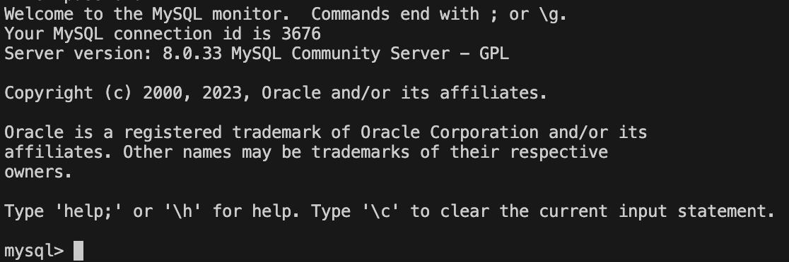
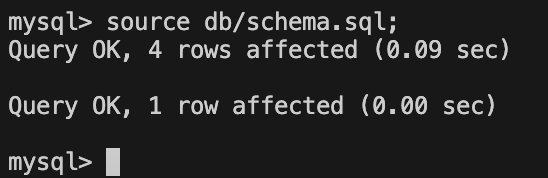
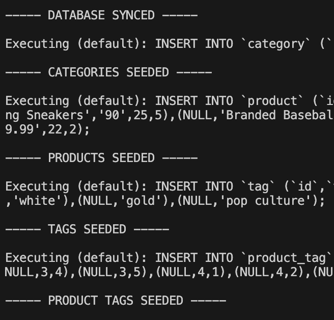

# E-commerce Back End Starter Code

## Table of Contents

- [Description](#description)
- [Installation](#installation)
- [Usage](#usage)
- [Credits](#credits)
- [License](#license)

## Description

This is back end project for an ecommerce website. Which use api calls to access and perform CRUD operations to the database. 

What was your motivation?

- I built this project to practice my newly acquired sequelize knowledge. 

Why did you build this project?

- The client needs a way to access and manipulate the database outside of a terminal, doing this backend api setup, should do that. 

What problem does it solve?

- Solves CRUD operations to their database for the client

What did you learn?

- I learned how much easier it is to access and manipulate the database than doing raw queries. There is so much logic and time when it comes raw queries, that it makes it a little difficult to switch between languages. 

## Installation

To begin using this project, you need to setup a few things. 

1. Use a zsh or bash terminal.
2. You need node.js installed on your computer. 
3. You also need mysql installed on your computer. 
4. Lastly you need something to test api calls. Like insomnia or postman.
4. Now you need the project code. Download or Clone the project at https://github.com/javieb5186/ecommerce-backend 
5. Navigate to the project via a terminal. 
6. Navigate to ecommerce-backend/Develop
7. Add a .env file containing your login to your mysql database. Either using the 'touch' commmand or in the desktop ui. 
8. Lastly, run npm i to install required packages.
9. You are now ready to start using


## Usage

### Setup

First, we need to create the database. 

Login to your mysql shell by running

```
mysql -u yourusername -p
```

A successful login will output the following image.



Then run the following command.

```
source db/schema.sql;
```

A successful output should look like this. 



Go ahead and exit by...

```
exit;
```

Now run...

```
node seeds/index;
```

Which will populate your database with testing data. 
A successful output will look like this. 



Now you are ready to start testing your data. 
So now run...

```
node server;
```

And it should console log "App listening on port"

You can now use the api to access/update you databases. 

### GET

You can get data from your database by entering this in your insomnia/postman as a GET.
Which should return a json object for you to view. 

- http://localhost:3001/api/categories
- http://localhost:3001/api/tags
- http://localhost:3001/api/products

You can get specific data by adding an id number at the end of the url.

- http://localhost:3001/api/categories/1
- http://localhost:3001/api/tags/1
- http://localhost:3001/api/products/1

### POST

To post/create data to the database, run this in your insomnia/postman as a POST.

- http://localhost:3001/api/categories
- http://localhost:3001/api/tags
- http://localhost:3001/api/products

With a json object being sent. Respectively it should be done by

```
{
	"category_name": "Underwear"
}
```
For categories.

```
{
	"tag_name": "All Colors"
}
```
For tags.

```
{
	"product_name": "Basketball",
	"price": 200.00,
	"stock": 3,
	"tagIds": [9, 2, 3, 4],
	"category_id": 6
}
```
For products. 

Which should then return a json object.

### PUT

The same respective json to send applies for updating.
So to update to your database, run the same json objects in your insomnia/postman as a PUT.

But this time it returns the number of affected changes. 

### DELETE

To delete items from your database, run the following calls in your insomnia/postman as a DELETE.

- http://localhost:3001/api/categories/1
- http://localhost:3001/api/tags/1
- http://localhost:3001/api/products/1

### Exit

And that's all there is to it. To close your access, do "CTRL + C".

## Credits

https://sequelize.org/docs/v6/core-concepts/assocs/

- Where I found how to make a relationship through another table

## License

MIT License

Copyright (c) 2023 javieb5186

Permission is hereby granted, free of charge, to any person obtaining a copy
of this software and associated documentation files (the "Software"), to deal
in the Software without restriction, including without limitation the rights
to use, copy, modify, merge, publish, distribute, sublicense, and/or sell
copies of the Software, and to permit persons to whom the Software is
furnished to do so, subject to the following conditions:

The above copyright notice and this permission notice shall be included in all
copies or substantial portions of the Software.

THE SOFTWARE IS PROVIDED "AS IS", WITHOUT WARRANTY OF ANY KIND, EXPRESS OR
IMPLIED, INCLUDING BUT NOT LIMITED TO THE WARRANTIES OF MERCHANTABILITY,
FITNESS FOR A PARTICULAR PURPOSE AND NONINFRINGEMENT. IN NO EVENT SHALL THE
AUTHORS OR COPYRIGHT HOLDERS BE LIABLE FOR ANY CLAIM, DAMAGES OR OTHER
LIABILITY, WHETHER IN AN ACTION OF CONTRACT, TORT OR OTHERWISE, ARISING FROM,
OUT OF OR IN CONNECTION WITH THE SOFTWARE OR THE USE OR OTHER DEALINGS IN THE
SOFTWARE.

## Links